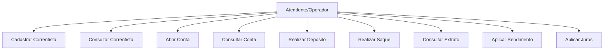

# Casos de Uso — API de Conta Bancária

## Atores

- **Atendente/Operador** — responsável por operar o sistema em nome da cooperativa (cadastra correntistas, abre contas, realiza operações).
- **Sistema (automático)** — responsável por cálculos de rendimento/juros quando disparados por agendamento ou requisição administrativa.

> Observação: o desafio não define perfis de cliente final self-service; assume-se que todas as operações são feitas por um operador da cooperativa.

## Diagrama de Casos de Uso (visão textual)

---

## UC01 — Cadastrar Correntista
**Fluxo principal:**
1. Operador envia dados (nome, documento, contato) para `POST /correntistas`.
2. Sistema valida documento único e campos obrigatórios.
3. Sistema persiste o correntista e retorna `201 Created`.
**Fluxo alternativo:** Documento já cadastrado → `409 Conflict`. Dados inválidos → `400 Bad Request`.

## UC02 — Consultar Correntista
**Fluxo principal:**
1. Operador solicita `GET /correntistas` (lista) ou `GET /correntistas/{id}` (detalhe).
2. Sistema retorna os dados encontrados (`200 OK`).
**Fluxo alternativo:** Id inexistente → `404 Not Found`.

## UC03 — Abrir Conta
**Pré-condição:** Correntista existente.
**Fluxo principal:**
1. Operador envia `POST /contas` com correntistaId, tipo (CORRENTE/POUPANCA) e, se aplicável, limite.
2. Sistema gera número de conta único, saldo inicial zero.
3. Sistema persiste a conta e retorna `201 Created`.
**Fluxo alternativo:** Correntista inexistente → `404 Not Found`.

## UC04 — Consultar Conta
**Fluxo principal:**
1. Operador solicita `GET /contas/{id}` ou `GET /contas?correntistaId=`.
2. Sistema retorna dados da(s) conta(s), incluindo saldo e tipo.
**Fluxo alternativo:** Conta inexistente → `404 Not Found`.

## UC05 — Realizar Depósito
**Pré-condição:** Conta existente.
**Fluxo principal:**
1. Operador envia `POST /contas/{id}/depositos` com o valor.
2. Sistema valida valor positivo.
3. Sistema incrementa o saldo da conta.
4. Sistema registra Transação (tipo DEPOSITO).
5. Retorna `201 Created` com o comprovante/saldo atualizado.
**Fluxo alternativo:** Valor inválido (≤ 0) → `400 Bad Request`.

## UC06 — Realizar Saque
**Pré-condição:** Conta existente com saldo/limite suficiente.
**Fluxo principal:**
1. Operador envia `POST /contas/{id}/saques` com o valor.
2. Sistema valida valor positivo.
3. Sistema aplica a regra de saque conforme o tipo de conta (RN03/RN04).
4. Sistema debita o saldo e registra Transação (tipo SAQUE).
5. Retorna `201 Created` com o saldo atualizado.
**Fluxo alternativo:** Saldo/limite insuficiente → `422 Unprocessable Entity` (ou `400`, conforme padrão adotado).

## UC07 — Consultar Extrato
**Fluxo principal:**
1. Operador solicita `GET /contas/{id}/transacoes` (com filtros opcionais de data).
2. Sistema retorna a lista de transações da conta ordenada por data.
**Fluxo alternativo:** Conta inexistente → `404 Not Found`.

## UC08 — Aplicar Rendimento (Diferencial)
**Pré-condição:** Conta do tipo Poupança.
**Fluxo principal:**
1. Operador envia `POST /contas/{id}/rendimento?taxa=0.005`.
2. Sistema valida que a conta é Poupança.
3. Sistema calcula `saldo += saldo * taxa`.
4. Sistema registra Transação (tipo RENDIMENTO) e retorna saldo atualizado.
**Fluxo alternativo:** Conta não é Poupança → `422 Unprocessable Entity`.

## UC09 — Aplicar Juros (Diferencial)
**Pré-condição:** Conta do tipo Corrente com saldo negativo.
**Fluxo principal:**
1. Operador envia `POST /contas/{id}/juros?taxa=0.02`.
2. Sistema valida que a conta é Corrente e o saldo é negativo.
3. Sistema calcula os juros sobre o saldo devedor e agrava o saldo.
4. Sistema registra Transação (tipo JUROS) e retorna saldo atualizado.
**Fluxo alternativo:** Conta não é Corrente ou saldo não é negativo → `422 Unprocessable Entity`.
