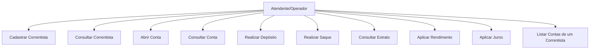

# Casos de Uso — API de Conta Bancária

## Atores

- **Atendente/Operador** — responsável por operar o sistema em nome da cooperativa (cadastra correntistas, abre contas, realiza operações).
- **Sistema (automático)** — responsável pelos cálculos de rendimento/juros quando disparados por requisição administrativa.

> Observação: todas as operações são feitas por um operador da cooperativa; não há perfil de cliente final self-service.

## Diagrama de Casos de Uso (visão textual)

---

## UC01 — Cadastrar Correntista
**Fluxo principal:**
1. Operador envia dados (nome, documento, e-mail e/ou telefone opcionais) para `POST /api/v1/correntistas`.
2. Sistema valida documento único; se e-mail e/ou telefone forem informados, também precisam ser únicos.
3. Sistema persiste o correntista e retorna `201 Created` com `Location`.

**Fluxo alternativo:** Documento, e-mail ou telefone já cadastrados → `409 Conflict`. Nome ou documento ausentes → `400 Bad Request`.

## UC02 — Consultar Correntista
**Fluxo principal:**
1. Operador solicita `GET /api/v1/correntistas` (lista paginada, filtro opcional `documento`) ou `GET /api/v1/correntistas/{id}` (detalhe).
2. Sistema retorna os dados encontrados (`200 OK`).

**Fluxo alternativo:** Id inexistente → `404 Not Found`.

## UC03 — Abrir Conta
**Pré-condição:** Correntista existente.
**Fluxo principal:**
1. Operador envia `POST /api/v1/contas` com `correntistaId`, `tipo` (`CORRENTE`/`POUPANCA`) e, se corrente, `limite` opcional.
2. Sistema gera número de conta único e define saldo inicial zero.
3. Sistema persiste a conta e retorna `201 Created` com `Location`.

**Fluxo alternativo:**
- Correntista inexistente → `404 Not Found`.
- `limite` negativo em conta corrente → `400 Bad Request`.
- `limite` informado (diferente de zero) em conta poupança → deveria ser `400 Bad Request` conforme contrato; **ver observação de bug no documento 05**, hoje retorna `422`.

## UC04 — Consultar Conta
**Fluxo principal:**
1. Operador solicita `GET /api/v1/contas/{id}` ou `GET /api/v1/contas` com filtros opcionais `correntistaId`/`numero` (paginado).
2. Sistema retorna dados da(s) conta(s), incluindo saldo, tipo, limite (se corrente) e titular.

**Fluxo alternativo:** Conta inexistente → `404 Not Found`. `correntistaId` do filtro inexistente → `404 Not Found`.

## UC05 — Realizar Depósito
**Pré-condição:** Conta existente.
**Fluxo principal:**
1. Operador envia `POST /api/v1/contas/{id}/depositos` com `{ "valor": 100.00 }`.
2. Sistema valida valor estritamente positivo.
3. Sistema incrementa o saldo da conta e registra Transação (tipo `DEPOSITO`).
4. Retorna `201 Created` com a transação e o `saldoAtual`.

**Fluxo alternativo:** Valor ausente, zero ou negativo → `400 Bad Request`. Conta inexistente → `404 Not Found`.

## UC06 — Realizar Saque
**Pré-condição:** Conta existente com saldo/limite suficiente.
**Fluxo principal:**
1. Operador envia `POST /api/v1/contas/{id}/saques` com `{ "valor": 50.00 }`.
2. Sistema valida valor estritamente positivo.
3. Sistema aplica a regra de saque conforme o tipo de conta (RN03/RN04).
4. Sistema debita o saldo e registra Transação (tipo `SAQUE`).
5. Retorna `201 Created` com a transação e o `saldoAtual`.

**Fluxo alternativo:** Valor ausente, zero ou negativo → `400 Bad Request`. Saldo/limite insuficiente → `422 Unprocessable Entity`. Conta inexistente → `404 Not Found`.

## UC07 — Consultar Extrato
**Fluxo principal:**
1. Operador solicita `GET /api/v1/contas/{contaId}/extrato`, com filtros opcionais `tipo` (`DEPOSITO`/`SAQUE`/`RENDIMENTO`/`JUROS`), `dataInicial` e `dataFinal` (ISO-8601), além de paginação.
2. Sistema retorna a lista de transações da conta que atendem aos filtros.

**Fluxo alternativo:**
- Conta inexistente → `404 Not Found`.
- `dataInicial` posterior a `dataFinal` → `400 Bad Request`.

> O endpoint deste caso de uso é `/contas/{contaId}/extrato` (ajustado a partir
> da versão anterior deste documento, que citava `/transacoes`).

## UC08 — Aplicar Rendimento (Diferencial)
**Pré-condição:** Conta do tipo Poupança, com saldo positivo.
**Fluxo principal:**
1. Operador envia `POST /api/v1/contas/{id}/rendimento` com a taxa via query string (`?taxa=0.005`) **ou** corpo (`{ "taxa": 0.005 }`).
2. Sistema valida que a conta é Poupança, que o saldo é positivo e que a taxa está entre `0` (exclusive) e `1` (inclusive).
3. Sistema valida que passaram pelo menos 30 dias desde a última aplicação de `RENDIMENTO` nessa conta *(regra nova, não presente na v1 deste documento)*.
4. Sistema calcula `saldo += saldo * taxa` (arredondado, escala 2, `HALF_EVEN`).
5. Sistema registra Transação (tipo `RENDIMENTO`) e retorna `saldoAtual`.

**Fluxo alternativo:** Conta não é Poupança, saldo não positivo ou taxa fora do intervalo → `422 Unprocessable Entity`. Aplicado antes de completar 30 dias da última vez → `422 Unprocessable Entity`. Conta inexistente → `404 Not Found`.

## UC09 — Aplicar Juros (Diferencial)
**Pré-condição:** Conta do tipo Corrente com saldo negativo.
**Fluxo principal:**
1. Operador envia `POST /api/v1/contas/{id}/juros` com a taxa via query string ou corpo.
2. Sistema valida que a conta é Corrente, que o saldo é negativo e que a taxa está entre `0` (exclusive) e `1` (inclusive).
3. Sistema valida o período mínimo de 30 dias desde a última aplicação de `JUROS` nessa conta *(regra nova)*.
4. Sistema calcula `saldo -= |saldo| * taxa` e agrava a dívida.
5. Sistema registra Transação (tipo `JUROS`) e retorna `saldoAtual`.

**Fluxo alternativo:** Conta não é Corrente, saldo não negativo, taxa fora do intervalo, ou período mínimo não cumprido → `422 Unprocessable Entity`. Conta inexistente → `404 Not Found`.

## UC10 — Listar Contas de um Correntista *(Novo)*
**Pré-condição:** Correntista existente.
**Fluxo principal:**
1. Operador solicita `GET /api/v1/correntistas/{id}/contas`.
2. Sistema retorna a lista (não paginada) de todas as contas vinculadas ao correntista.

**Fluxo alternativo:** Correntista inexistente → `404 Not Found`.