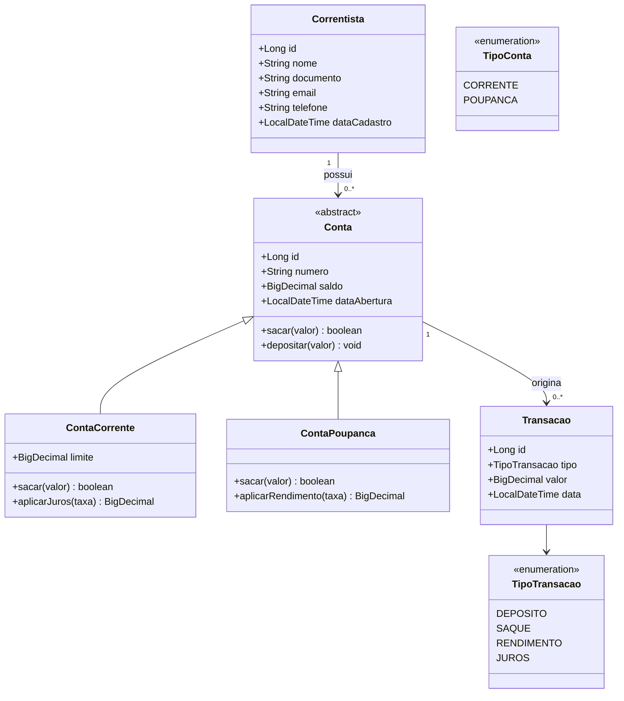

# Modelagem de Domínio / Entidades

## 1. Diagrama de Classes (visão conceitual)

## 2. Descrição das Entidades

### Correntista
Representa o cliente da cooperativa.
- `id`: identificador único
- `nome`: nome completo (obrigatório)
- `documento`: CPF ou CNPJ (obrigatório, único)
- `email`, `telefone`: dados de contato opcionais; quando informados, devem ser únicos entre os correntistas
- `dataCadastro`: preenchida automaticamente
- Relacionamento: 1 Correntista → N Contas

### Conta (classe abstrata / superclasse)
Representa o contrato comum entre os tipos de conta.
- `id`, `numero` (único), `saldo`, `dataAbertura`
- `correntista`: referência ao dono da conta
- Comportamentos abstratos: `sacar(valor)` e `depositar(valor)` — cada subtipo implementa sua própria regra de saque (**polimorfismo**)

### ContaCorrente (herda de Conta)
- Atributo adicional: `limite` (crédito rotativo)
- `sacar(valor)`: permitido enquanto `valor <= saldo + limite`
- `aplicarJuros(taxa)`: aplicado apenas quando `saldo < 0`

### ContaPoupanca (herda de Conta)
- Sem atributo de limite
- `sacar(valor)`: permitido apenas enquanto `valor <= saldo`
- `aplicarRendimento(taxa)`: aplicado sobre saldo positivo

### Transacao
Registro imutável de uma movimentação financeira.
- `id`, `tipo` (enum `TipoTransacao`), `valor`, `data`
- `conta`: referência à conta de origem (obrigatória, não nula)

## 3. Enums

| Enum | Valores | Uso |
|------|---------|-----|
| `TipoConta` | `CORRENTE`, `POUPANCA` | Discriminação da subclasse (estratégia de herança JPA) |
| `TipoTransacao` | `DEPOSITO`, `SAQUE`, `RENDIMENTO`, `JUROS` | Categoriza a transação registrada |

## 4. Decisões de Modelagem (OO)

- **Herança**: `Conta` é abstrata; `ContaCorrente` e `ContaPoupanca` sobrescrevem `sacar()` — cada uma aplicando sua própria regra de negócio (RN03/RN04). Isso evita `if/else` espalhado por tipo de conta no Service.
- **Encapsulamento**: o saldo não deve ter setter público; alterações de saldo só ocorrem através dos métodos de domínio (`depositar`, `sacar`, `aplicarJuros`, `aplicarRendimento`), que também são responsáveis por validar a regra antes de alterar o estado.
- **Abstração**: o `TransacaoService` (camada de serviço) não precisa saber os detalhes de cada tipo de conta — apenas chama `conta.sacar(valor)` e trata o retorno/exceção.
- Alternativa de persistência de herança: `JOINED` (tabela por subclasse) é a mais indicada aqui por já existir campo específico (`limite`) apenas em `ContaCorrente` — ver documento de modelagem do banco de dados.
