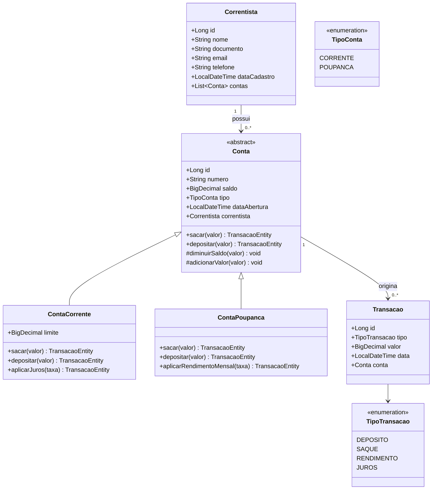

# Modelagem de Domínio / Entidades

## 1. Diagrama de Classes (visão conceitual)

## 2. Descrição das Entidades

### Correntista
Representa o cliente da cooperativa.
- `id`: identificador único
- `nome`: nome completo (obrigatório)
- `documento`: CPF ou CNPJ (obrigatório, único)
- `email`, `telefone`: dados de contato opcionais; quando informados, devem ser únicos entre os correntistas
- `dataCadastro`: preenchida automaticamente (`@PrePersist`)
- Relacionamento: 1 Correntista → N Contas (`@OneToMany`, cascade `ALL`, `orphanRemoval = true`)

### Conta (classe abstrata / superclasse)
Representa o contrato comum entre os tipos de conta.
- `id`, `numero` (único, gerado pela aplicação), `saldo`, `tipo`, `dataAbertura`
- `correntista`: referência ao dono da conta (`@ManyToOne`, obrigatória)
- `saldo` **não possui setter público** — só é alterado pelos métodos protegidos `diminuirSaldo(valor)` e `adicionarValor(valor)`, chamados de dentro das próprias subclasses
- Comportamentos abstratos: `sacar(valor)` e `depositar(valor)`, ambos retornando a `TransacaoEntity` já criada (não persistida) — cada subtipo implementa sua própria regra de saque (**polimorfismo**)

### ContaCorrente (herda de Conta)
- Atributo adicional: `limite` (crédito rotativo), padrão `ZERO`
- `sacar(valor)`: permitido enquanto `valor <= saldo + limite`; o saldo **pode ficar negativo** — isso é o próprio uso do limite/cheque especial
- `depositar(valor)`: exige valor estritamente positivo
- `aplicarJuros(taxa)`: exige `saldo < 0` e `taxa` em `(0, 1]`; calcula `juros = |saldo| * taxa` (escala 2, `HALF_EVEN`) e agrava a dívida via `diminuirSaldo(juros)`

### ContaPoupanca (herda de Conta)
- Sem atributo de limite
- `sacar(valor)`: permitido apenas enquanto `valor <= saldo`
- `depositar(valor)`: exige valor estritamente positivo
- `aplicarRendimentoMensal(taxa)`: exige `saldo > 0` e `taxa` em `(0, 1]`; calcula `rendimento = saldo * taxa` (escala 2, `HALF_EVEN`) e soma ao saldo via `adicionarValor(rendimento)`

### Transacao
Registro imutável de uma movimentação financeira.
- `id`, `tipo` (enum `TipoTransacao`), `valor`, `data` (preenchida via `@PrePersist` se não informada)
- `conta`: referência à conta de origem (`@ManyToOne`, obrigatória, `optional = false`)

## 3. Enums

| Enum | Valores | Uso |
|------|---------|-----|
| `TipoConta` | `CORRENTE`, `POUPANCA` | Persistido como coluna auxiliar em `conta.tipo`, usado para filtros e serialização; a estratégia de herança JPA (`JOINED`) já discrimina a subclasse pela presença de linha em `conta_corrente`/`conta_poupanca` |
| `TipoTransacao` | `DEPOSITO`, `SAQUE`, `RENDIMENTO`, `JUROS` | Categoriza a transação registrada; também usado como filtro no extrato |

## 4. Decisões de Modelagem (OO)

- **Herança**: `Conta` é abstrata; `ContaCorrente` e `ContaPoupanca` sobrescrevem `sacar()`/`depositar()` — cada uma aplicando sua própria regra de negócio (RN03/RN04). Isso evita `if/else` por tipo de conta na camada de serviço.
- **Encapsulamento**: o saldo não tem setter público; toda alteração passa pelos métodos de domínio (`depositar`, `sacar`, `aplicarJuros`, `aplicarRendimentoMensal`), que validam a regra antes de mutar o estado.
- **Retorno como `TransacaoEntity`**: em vez de `boolean`/`void` (como constava na v1 deste documento), os métodos de domínio retornam a transação já construída (não persistida). Quem persiste a transação e monta a resposta HTTP é a camada de serviço (`TransacaoService`) — mantendo a entidade sem dependência do repositório.
- **Abstração**: o `TransacaoService` não precisa conhecer os detalhes de cada tipo de conta — chama `conta.sacar(valor)`/`conta.depositar(valor)` e trata o retorno/exceção; para `aplicarJuros`/`aplicarRendimentoMensal` faz um `instanceof` explícito, já que essas operações são exclusivas de um tipo (Java 8 não permite pattern matching de `instanceof`, então o cast é feito manualmente).
- **Regra de período mínimo (30 dias)**: fica fora da entidade, no `TransacaoService`, pois depende de consultar o histórico de transações no `ITransacaoRepository` — algo que a entidade de domínio não deve fazer diretamente.
- Estratégia de persistência de herança: `JOINED` (tabela por subclasse) — ver documento de modelagem do banco de dados.